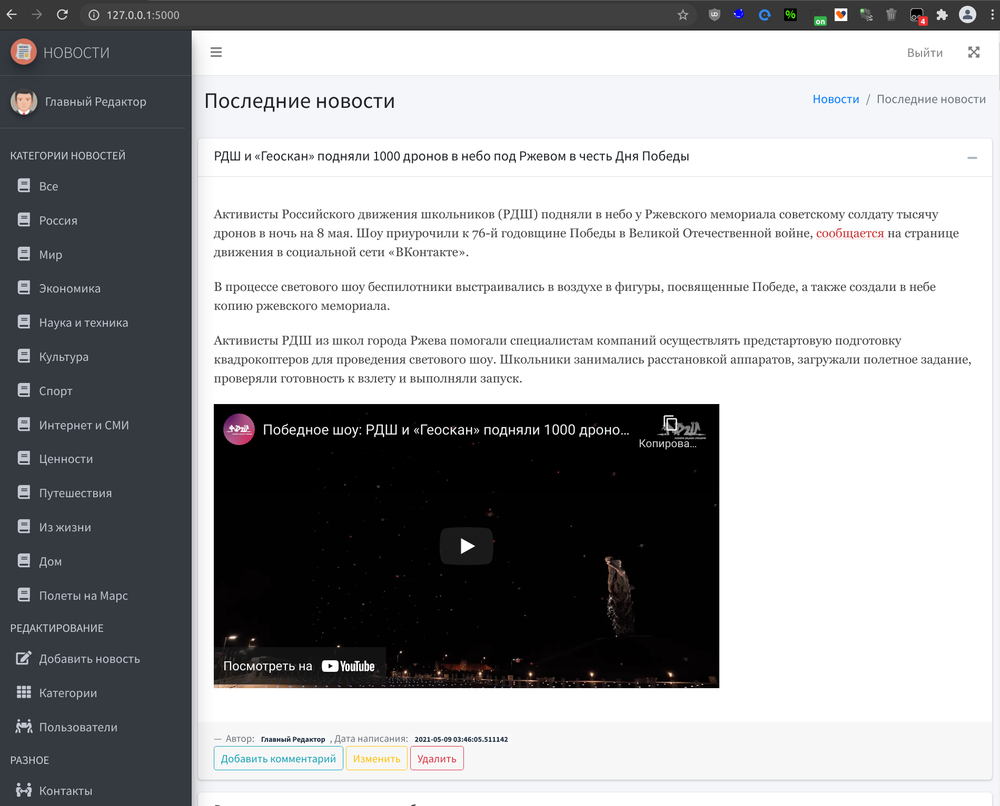
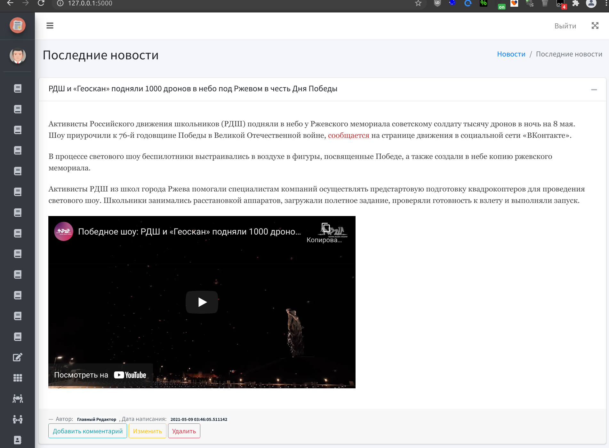
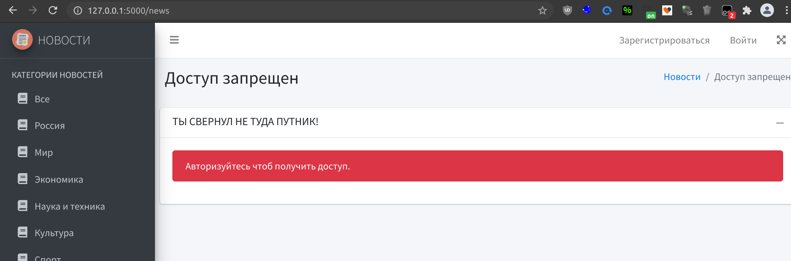
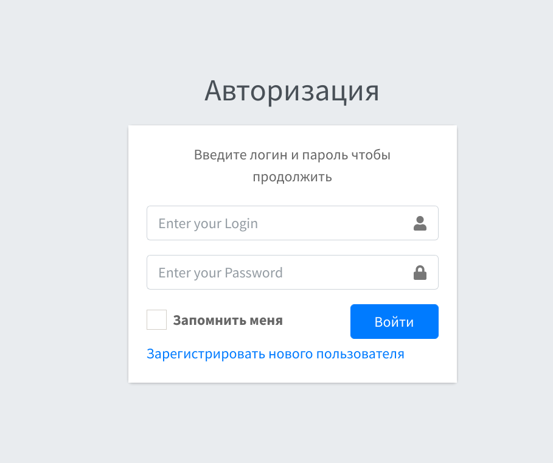
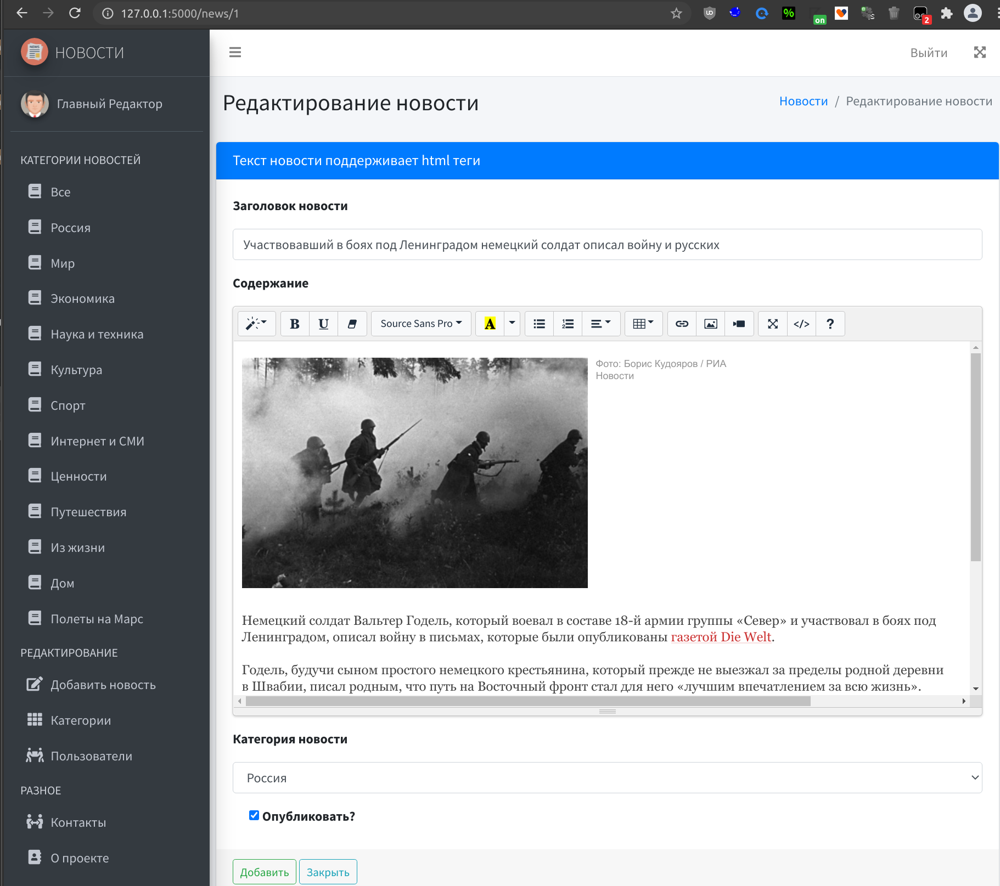

## Оглавление
0. [Запуск](#Запуск)
1. [Используемые технологии и Особенности проекта](#Используемые-технологии-и-Особенности-проекта)
2. [Зачем?](#Зачем?)
3. [Внешний вид](#Внешний-вид)


## Запуск
Перед запуском проекта установите необходимые зависимости 
```bash
  pip install -r requirements.txt
```

* Администратор `admin/12345`
* Пользователь `user/123`

Проект разработан в Linux. Версия Python 3.9 и выше (проверено и в 3.8).
____
[:arrow_up:Оглавление](#Оглавление)


## Используемые технологии и Особенности проекта
* flask
* flask-wtf
* waitress
* все формы защищены CSRF
* API реализовано через flask_restful, но без авторизации, чтобы можно было просто его тестировать простыми запросами
    * для тестов api есть unittest test_unittest.py
        * /api/v2/news
        * /api/v2/users
        * /api/v2/news/<int:news_id>
        * /api/v2/users/<int:user_id>
  
* ORM база данных со множеством связей (я знаю что sqlite не самое лучшее решение, я бы использовал postrges, но его запустить локально не все смогут)
    * например если удалить пользователя, то все его комментарии удалятся автоматически без доп запросов, тоже и с новостями
    
* очень много bootstrap + js
    * например модальные окна для комментариев
    * комментарии сразу не показываются, но их можно развернуть по кнопке, на которой показано сколько их там И если их нет то кнопки и не будет
    * меню сворачивается 
    * новости можно свернуть
    * WYSIWYG редактор для новостей
    * изображения новостей лежат в базе и при удалении новости нет проблем с удалением изображений с диска
    * сделана защита от "дурака" админ сам себя удалить не может. При любых действиях должен остаться хоть один админ.
        
* кастомные странички на типовые http ошибки 
* виртуальный сервер на Amazon AWS
    * Проект развернут на виртуальной машине в облаке Amazon (AWS)
    * Большая просьба для тестирующих не сносить уже созданые новости и категории, можете создавать свои, но не забыть их за собой почистить ;-)
(увижу каку, пересоздам базу).
    * Используется ngnix proxy для проксирования на 80 порт. SSL не включал, ибо для него нужно доменное имя, но проект только демо для показа умений.
    * в качестве серверной OS используется ubuntu server (мог поставить и на своих серверах с доменными именем, но это деанон, что по правилам проекта запрещено)
    
* разные пункты и возможности пользователей
    * админ может все, в том числе и перевести обычного пользователя в админа или сменить ему пароль.
    * пользователь может только добавлять комментарии
    * не зарегистрированный пользователь может только читать и просматривать комментарии

____
[:arrow_up:Оглавление](#Оглавление)


## Зачем?
Философский вопрос... Потому что требуется для защиты себя, как преподавателя 2 года обучения, ну и потому что могу и умею.
Новости честно стащил с новостных сайтов, чтобы показать примеры. Все материалы lenta.ru 
____
[:arrow_up:Оглавление](#Оглавление)


## Внешний вид






____
[:arrow_up:Оглавление](#Оглавление)
